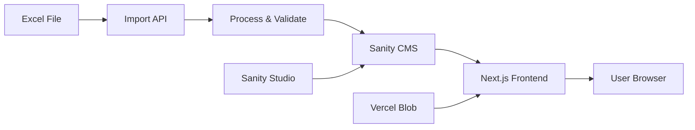

# Century Italia - Project Infrastructure Documentation


This document provides a comprehensive overview of the infrastructure setup for the Century Italia project, including Git repository, Sanity CMS configuration, and Vercel deployment details.

---

## 📋 Table of Contents

1. [Project Overview](#project-overview)
2. [Git Repository](#git-repository)
3. [Sanity CMS Configuration](#sanity-cms-configuration)
4. [Vercel Deployment](#vercel-deployment)
5. [Environment Variables](#environment-variables)
6. [Technology Stack](#technology-stack)
7. [Project Architecture](#project-architecture)
8. [Access Information](#access-information)

---

## 🎯 Project Overview

**Project Name**: Century Italia - Lighting Product Catalog  
**Description**: A modern, high-performance lighting product catalog website built with Next.js and Sanity CMS, featuring comprehensive product management, category organization, and SEO optimization.

**Key Features**:
- Server-side rendered React application with Next.js 15+
- Headless CMS with Sanity for content management
- Automated product import system with nightly cron jobs
- Real-time visual editing capabilities
- Multi-language support
- SEO optimized with excellent PageSpeed scores

---

## 🔗 Git Repository

### Repository Information

| Property | Value |
|----------|-------|
| **Platform** | GitHub |
| **Repository URL** | [https://github.com/centuryitalia/Century](https://github.com/centuryitalia/Century) |
| **Repository Owner** | Century |
| **Repository Name** | century-sanity-plus-next |
| **Default Branch** | master |
| **Development Branch** | stage |

### Branch Strategy

- **`master`** - Production branch, deployed to Vercel production
- **`stage`** - Development/staging branch for testing before production
- Feature branches are created from `stage` and merged back after review

### Clone Command

```bash
git clone https://github.com/centuryitalia/Century
cd Century
```

### Repository Structure

```
century/
├── frontend/              # Next.js frontend application
│   ├── app/              # Next.js App Router pages
│   ├── components/       # React components
│   ├── lib/              # Utility functions and Sanity client
│   ├── public/           # Static assets
│   ├── package.json      # Frontend dependencies
│   └── vercel.json       # Vercel configuration
├── studio/               # Sanity CMS Studio
│   ├── src/
│   │   ├── schemaTypes/  # Content schemas
│   │   └── structure/    # Studio structure configuration
│   ├── sanity.config.ts  # Sanity configuration
│   └── package.json      # Studio dependencies
├── package.json          # Root package.json with workspace config
└── README.md             # Project documentation
```

---

## 🎨 Sanity CMS Configuration

### Sanity Project Details

| Property | Value |
|----------|-------|
| **Project ID** | `lnqcgpdf (will-update-with-your-account)` |
| **Dataset** | `production` |
| **Project Title** | Sanity + Next.js Starter Template |
| **Studio URL (Local)** | http://localhost:3333 |
| **Studio URL (Production)** | [https://century-sanity-plus-next-studio.vercel.app](https://century-sanity-plus-next-studio.vercel.app) |

### Content Schemas

#### 1. Product Schema
Comprehensive lighting product management with **40+ custom fields** organized in 5 groups:

- **General Characteristics**: Name, item number, EAN code, technology, family, line, categories
- **Technical Features**: Power, luminous flux, light color, CRI, voltage, IP/IK ratings
- **Dimensions**: Length, width, thickness, weight
- **Packing**: Package type, carton quantities, gross weight
- **Media & Images**: Product images, gallery, technical documents

#### 2. Category Schema
Hierarchical category organization with:

- Basic information (name, slug, description, image)
- Parent-child category relationships
- Bidirectional product assignments
- SEO metadata (meta title, meta description)
- Display order and active/inactive toggle

#### 3. Additional Schemas
- **Page Schema**: Custom pages with flexible content
- **Post Schema**: Blog posts and articles
- **Person Schema**: Authors and team members
- **Settings Schema**: Site-wide settings (singleton)

### Sanity Plugins

The studio uses the following plugins:

1. **Presentation Tool** - Visual editing with live preview
2. **Structure Tool** - Custom studio structure
3. **Unsplash Image Asset** - Stock image integration
4. **Sanity Assist** - AI-powered content assistance
5. **Vision Tool** - GROQ query testing

### Sanity Configuration File
Key configurations:
- Project ID and dataset from environment variables
- Preview URL for visual editing
- Document resolvers for different content types
- Location resolvers for presentation tool

---

## 🚀 Vercel Deployment

### Deployment Information

| Property | Value |
|----------|-------|
| **Platform** | Vercel |
| **Frontend URL** | [https://century-sanity-plus-next-frontend.vercel.app](https://century-sanity-plus-next-frontend.vercel.app) |
| **Studio URL** | [https://century-sanity-plus-next-studio.vercel.app](https://century-sanity-plus-next-studio.vercel.app) |
| **Framework** | Next.js |
| **Node Version** | 20.x |
| **Build Command** | `npm run build` |
| **Output Directory** | `.next` |

### Vercel Configuration

```json
{
  "framework": "nextjs",
  "crons": [
    {
      "path": "/api/import/cron",
      "schedule": "0 2 * * *"
    }
  ]
}
```

### Cron Jobs

**Automated Product Import**:
- **Path**: `/api/import/cron`
- **Schedule**: `0 2 * * *` (Daily at 2:00 AM UTC)
- **Purpose**: Automated nightly import of product data from Excel files

### Deployment Workflow

1. **Automatic Deployments**:
   - Push to `master` branch → Production deployment
   - Push to `stage` branch → Preview deployment

2. **Build Process**:
   - Install dependencies
   - Run Sanity type generation (`npm run typegen`)
   - Build Next.js application (`next build`)
   - Deploy to Vercel edge network

3. **Preview Deployments**:
   - Every pull request gets a unique preview URL
   - Automatic preview updates on new commits

---

## 🔐 Environment Variables

### Frontend Environment Variables

Required for the Next.js application:

| Variable | Description | Example |
|----------|-------------|---------|
| `NEXT_PUBLIC_SANITY_PROJECT_ID` | Sanity project ID (public) | `lnqcgpdf (will-update-with-your-account)` |
| `NEXT_PUBLIC_SANITY_DATASET` | Sanity dataset name (public) | `production` |
| `SANITY_API_READ_TOKEN` | Sanity API token for server-side reads | `sk...` (secret) |
| `BLOB_READ_WRITE_TOKEN` | Vercel Blob storage token | `vercel_blob_...` (secret) |

### Studio Environment Variables

Required for Sanity Studio:

| Variable | Description | Example |
|----------|-------------|---------|
| `SANITY_STUDIO_PROJECT_ID` | Sanity project ID | `lnqcgpdf (will-update-with-your-account)` |
| `SANITY_STUDIO_DATASET` | Sanity dataset name | `production` |
| `SANITY_STUDIO_PREVIEW_URL` | Frontend URL for preview | `http://localhost:3000` (local)<br>`https://century-sanity-plus-next-frontend.vercel.app` (production) |

### Setting Up Environment Variables

#### Local Development

**Frontend** (`.env.local` in `frontend/` directory):
```env
NEXT_PUBLIC_SANITY_PROJECT_ID=lnqcgpdf (will-update-with-your-account)
NEXT_PUBLIC_SANITY_DATASET=production
SANITY_API_READ_TOKEN=your_token_here
BLOB_READ_WRITE_TOKEN=your_blob_token_here
```

**Studio** (`.env` in `studio/` directory):
```env
SANITY_STUDIO_PROJECT_ID=lnqcgpdf (will-update-with-your-account)
SANITY_STUDIO_DATASET=production
SANITY_STUDIO_PREVIEW_URL=http://localhost:3000
```

#### Vercel Production

1. Go to Vercel Dashboard → Project Settings → Environment Variables
2. Add each variable with appropriate scope (Production/Preview/Development)
3. Redeploy to apply changes

### Obtaining Sanity API Token

1. Visit [sanity.io/manage](https://sanity.io/manage)
2. Select project `lnqcgpdf (will-update-with-your-account)`
3. Navigate to **API** → **Tokens**
4. Click **Add API token**
5. Configure:
   - **Name**: Vercel Read Token
   - **Permissions**: Viewer (read-only) or Editor (read-write)
6. Copy token and add to environment variables

---

## 🛠️ Technology Stack

### Frontend

| Technology | Version | Purpose |
|------------|---------|---------|
| **Next.js** | 15.5.7 | React framework with App Router |
| **React** | 19.1.1 | UI library |
| **TypeScript** | 5.9.2 | Type safety |
| **Tailwind CSS** | 4.1.12 | Utility-first CSS framework |
| **next-sanity** | 10.0.14 | Sanity integration for Next.js |
| **@sanity/client** | 7.9.0 | Sanity client library |
| **@vercel/blob** | 0.27.0 | Vercel Blob storage |
| **@vercel/speed-insights** | 1.2.0 | Performance monitoring |
| **xlsx** | 0.18.5 | Excel file processing |

### CMS (Sanity Studio)

| Technology | Version | Purpose |
|------------|---------|---------|
| **Sanity** | 4.5.0 | Headless CMS |
| **@sanity/vision** | Latest | GROQ query testing |
| **sanity-plugin-asset-source-unsplash** | Latest | Stock images |
| **@sanity/assist** | Latest | AI content assistance |

### Development Tools

- **ESLint** - Code linting
- **Prettier** - Code formatting
- **npm-run-all2** - Run multiple scripts in parallel

---

## 🏗️ Project Architecture

### Monorepo Structure

The project uses **npm workspaces** to manage two separate applications:

```json
{
  "workspaces": [
    "studio",
    "frontend"
  ]
}
```

### Frontend Architecture

```
frontend/
├── app/                      # Next.js App Router
│   ├── api/                 # API routes
│   │   ├── draft-mode/      # Draft mode for preview
│   │   └── import/          # Product import endpoints
│   │       ├── cron/        # Cron job handler
│   │       ├── execute/     # Import execution
│   │       └── process/     # Import processing
│   ├── layout.tsx           # Root layout
│   └── page.tsx             # Home page
├── components/              # React components
├── lib/                     # Utilities
│   ├── sanity/             # Sanity client and queries
│   └── import/             # Import system utilities
└── public/                 # Static assets
```

### Data Flow



### Import System Architecture

1. **Excel Upload**: Client uploads Excel file via Sanity Studio tool
2. **Processing**: API validates and maps 113 columns to product schema
3. **Media Handling**: Product images stored in Vercel Blob storage
4. **Sanity Update**: Products created/updated in Sanity CMS
5. **Automated Sync**: Nightly cron job processes new data
6. **Soft Delete**: Products marked inactive based on "articolo sul web" column

---

## 🔑 Access Information

### Repository Access

- **GitHub Repository**: [https://github.com/centuryitalia/Century](https://github.com/centuryitalia/Century)
- **Access Level**: Private repository (requires GitHub account with access)

### Sanity CMS Access

- **Sanity Manage**: [https://sanity.io/manage](https://sanity.io/manage)
- **Project ID**: `lnqcgpdf (will-update-with-your-account)`
- **Studio (Production)**: [https://century-sanity-plus-next-studio.vercel.app](https://century-sanity-plus-next-studio.vercel.app)
- **Access**: Requires Sanity account with project permissions

### Vercel Access

- **Vercel Dashboard**: [https://vercel.com/dashboard](https://vercel.com/dashboard)
- **Frontend**: [https://century-sanity-plus-next-frontend.vercel.app](https://century-sanity-plus-next-frontend.vercel.app)
- **Studio**: [https://century-sanity-plus-next-studio.vercel.app](https://century-sanity-plus-next-studio.vercel.app)
- **Access**: Requires Vercel account with team/project access

---

## 📚 Additional Documentation

For more detailed information, refer to:

- [README.md](https://github.com/centuryitalia/Century/README.md) - Main project documentation
- [IMPORT_SYSTEM_README.md](https://github.com/centuryitalia/Century/IMPORT_SYSTEM_README.md) - Product import system details
- [PRODUCT_SCHEMA_DOCUMENTATION.md](https://github.com/centuryitalia/Century/studio/PRODUCT_SCHEMA_DOCUMENTATION.md) - Product schema guide
- [CATEGORY_SCHEMA_DOCUMENTATION.md](https://github.com/centuryitalia/Century/studio/CATEGORY_SCHEMA_DOCUMENTATION.md) - Category schema guide

---

## 📞 Support & Maintenance

**Project Maintainer**: Riccardo  
**Last Updated**: December 2025  
**Project Status**: Active Development

For questions or issues, please contact the project maintainer or create an issue in the GitHub repository.

---

**© 2025 Century Italia - All Rights Reserved**
